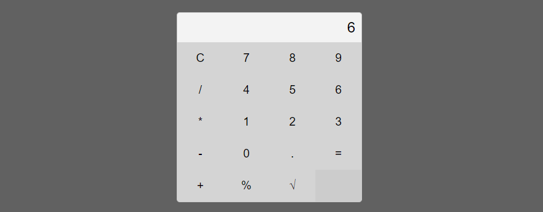

# Calculadora Simples

O projeto é uma calculadora simples desenvolvida usando HTML, CSS e JavaScript. A calculadora oferece operações básicas de adição, subtração, multiplicação e divisão, além de funcionalidades adicionais como porcentagem e raiz quadrada.

## 

## Como Executar o Projeto

### Pré-requisitos
- Navegador da web (recomendado: Chrome, Firefox, Safari)

### Passos

1. **Clone o Repositório:**
   ```bash
   git clone git@github.com:barbaradviana/Calculadora-Simples.git
2. **Abra o Projeto:**
   ```bash
   cd calculadora
3. **Abra o Arquivo HTML:**
   ```bash
   open index.html
Isso abrirá a calculadora no navegador padrão.

4. **Interaja com a Calculadora:**

Use os botões numéricos e de operação para realizar cálculos.
Experimente funcionalidades adicionais, como porcentagem e raiz quadrada.

## Nota
Certifique-se de ter um navegador da web instalado para visualizar a calculadora.

**Autor:** Bárbara Viana